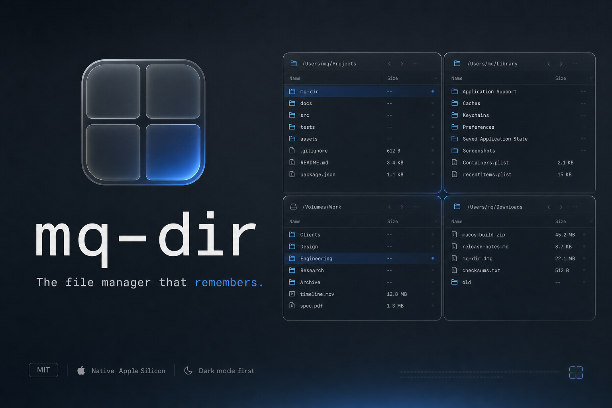

# mq-dir

> The native macOS file manager for AI multi-taskers. Up to four independent panes for parallel projects and agents — persistent state, native polish, no compromise.

[](#status)
[](#requirements)
[](https://swift.org)
[](LICENSE)

🌐 [mqdir.com](https://mqdir.com) · 📓 [Changelog](CHANGELOG.md) · 🛠 [Contributing](CONTRIBUTING.md)



## Why

A modern coding session is half source, half artifacts: generated images, recorded demos, PDFs, screenshots from QA, exported transcripts, downloaded models, design specs. None of it lives where your code does — and Finder wasn't built for that volume or for the way agents now produce work in parallel.

mq-dir gives you up to four independent panes side by side. One per project, one per agent, one for the artifact dump. Each pane keeps its own folder, sort, scroll position, and column widths — and remembers them across launches and force-quits.

## Features

**Working today (alpha.9)**

- 🟦 **1 / 2H / 2V / 4-pane layouts** — focused-pane routing, independent folder per pane.
- ↹ **Per-pane tabs** — Safari-style strip with X/+, ⌘T / ⌘W / ⌘⇧T / ⌘1…⌘9 / ⌘⇧[ / ⌘⇧], drag-to-reorder, right-click Close Other / Close to Right / Duplicate, last-tab safety placeholder.
- 🌳 **VS Code-style tree view** — per-tab toggle, lazy child loading, ⌘-click on a folder opens it as a new tab in the same pane.
- 👀 **Per-tab preview pane** — toggle in the pane header (or ⌘⇧P). Quick Look for images, PDF, code, video, audio, office docs; MarkdownUI for `.md` with full GFM (tables, code blocks, lists). Folder/multi/empty selections get custom summaries.
- ⭐ **User-editable Favorites sidebar** — drag folders in, right-click Remove or Rename, drag to reorder, ⌘D adds the focused pane's folder. Real Finder folder icons, stale-path styling.
- 📁 **Projects (workspaces)** — named snapshots of (layout + pane tabs + focus). + button creates one, click switches, right-click Rename / Delete, drag to reorder. Switching auto-saves the outgoing project.
- 💾 **State persistence** — every pane / tab / favorite / project survives relaunch, force-quit, and even schema upgrades (legacy `state.json` shapes auto-migrate).
- 🔎 **Per-pane recursive search** — debounced, case-insensitive substring match across the current folder's subtree. ⌘F.
- 🔄 **In-app auto-update** — Sparkle 2 polls the appcast every 24 h; when a new release is out, the sidebar grows an "Update Available" button that runs the standard install/relaunch flow.
- 🔗 **[cmux](https://cmux.com) sync** — sidebar grows a CMUX section that mirrors your cmux workspaces. Click a row to open its working directory in the focused pane (⌘-click for a new tab). Requires **cmux → Settings → Automation → Socket Control Mode = Allow All** (cmux ships locked to its own children); section stays hidden when cmux isn't installed.
- 🎨 **Native macOS look** — SwiftUI + AppKit, system theme tokens, hand-finished app icon.

**Coming next**

- 3-pane layout option.
- Spacebar floating Quick Look (Finder-style).
- Keyboard shortcut customization, settings UI.

## Status

**Alpha.** v0.1.0-alpha.9 is a Developer ID-signed, Apple-notarized release. The working set above is stable enough for daily-driving by the maintainer; expect rough edges around ergonomics and edge cases. Track per-release detail in [`CHANGELOG.md`](CHANGELOG.md).

## Requirements

- macOS 14 (Sonoma) or later
- Apple Silicon or Intel
- For building: Xcode 15+, [Homebrew](https://brew.sh)

## Install

### From the signed DMG (recommended)

Grab the latest `.dmg` from [Releases](https://github.com/h5nam/mq-dir/releases) and drag `mq-dir.app` into `/Applications`. Notarized + stapled, so Gatekeeper opens it without a right-click trick. The running app then auto-updates via Sparkle on its 24-hour cadence (or whenever you click the sidebar's "Update Available" button).

### From source

```bash
git clone https://github.com/h5nam/mq-dir.git
cd mq-dir
Scripts/bootstrap.sh   # installs XcodeGen and the xcodes CLI
open mq-dir.xcodeproj
```

`bootstrap.sh` generates `mq-dir.xcodeproj` from `project.yml` (XcodeGen is the source of truth — the `.xcodeproj` is not checked in).

**Tests-only** (no Xcode required, just the Swift toolchain):

```bash
swift test
```

## Privacy

**No telemetry. No crash reporting. No analytics. Ever, in v1.**

mq-dir is local-only for everything except the auto-update check. It reads your filesystem to show it back to you and writes its own state to `~/Library/Application Support/com.mqdir.app/`. The single network egress is Sparkle fetching `https://h5nam.github.io/mq-dir/appcast.xml` once a day to look for a newer release; nothing else phones home.

If a v1.x release ever proposes opt-in crash reporting, it will land behind a config toggle defaulting to off, with the source clearly visible.

## Out of scope for v1

Cloud sync, archive previews, file editing, plugins, iPadOS/iOS port, localization beyond English.

## Contributing

PRs welcome. Contributions are accepted via [DCO](https://developercertificate.org/) — every commit needs a `Signed-off-by:` line. **No CLA.** See [`CONTRIBUTING.md`](CONTRIBUTING.md) for the workflow, [`SECURITY.md`](SECURITY.md) for vulnerability disclosure, and [`CODE_OF_CONDUCT.md`](CODE_OF_CONDUCT.md).

## Releasing (maintainers only)

```bash
Scripts/release.sh 0.1.0-alpha.10
```

That's it. The script bumps the version, builds Release with Developer ID, re-signs every nested binary inside-out (Sparkle's helpers don't auto-inherit signing), notarizes via the stored `mq-dir-notary` keychain profile + staples, builds and EdDSA-signs the DMG, appends a fresh `<item>` to `docs/appcast.xml`, bumps `Casks/mq-dir.rb`, tags + pushes, and creates the GitHub release.

**One-time setup** (per maintainer machine):

```bash
Scripts/sparkle-setup.sh
# → downloads Sparkle binary tools, generates the EdDSA key pair in your
#   macOS keychain, prints the public half. Already embedded in
#   project.yml's SUPublicEDKey for this project; only needed if a
#   future maintainer rotates the key.

xcrun notarytool store-credentials mq-dir-notary \
    --apple-id <your-apple-id> --team-id WKV6T7K33K \
    --password <app-specific-password>

brew install create-dmg
gh auth login
```

Plus give codesign access to the Developer ID private key once: Keychain Access → login → My Certificates → expand `Developer ID Application: …` → right-click the private key → Get Info → Access Control → **Allow all applications to access this item**. Without this, every release prompts for your Mac password ~10 times during the inside-out re-sign.

GitHub Pages is already enabled on `main` / `/docs` so the appcast at `https://h5nam.github.io/mq-dir/appcast.xml` updates within a minute of every push.

## License

MIT — see [`LICENSE`](LICENSE).

## Acknowledgments

mq-dir's quad-pane layout is inspired by **[Q-Dir](https://www.q-dir.com/)** by SoftwareOK / Nenad Hrg, a long-running Windows file manager that made the case for multi-pane file management. mq-dir is an independent, clean-room implementation in Swift for macOS — **not affiliated with, endorsed by, or derived from Q-Dir's source code**.
